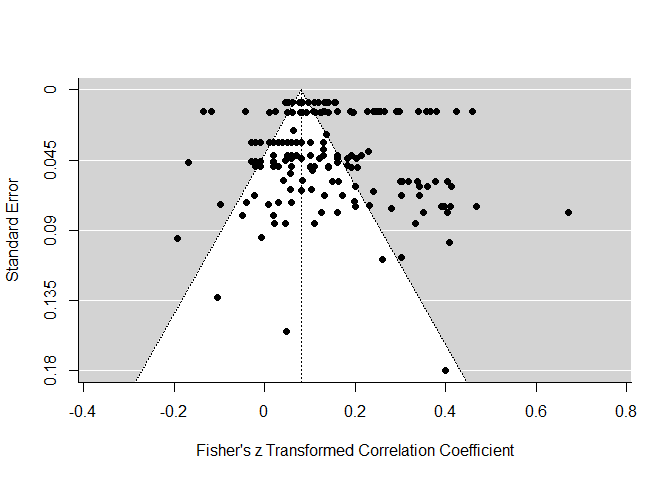
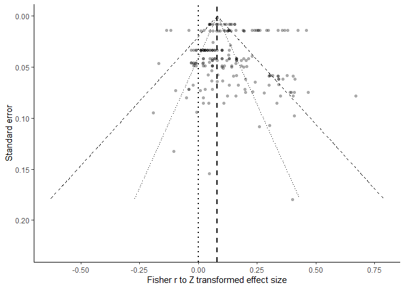

Child Maltreatment and Adolescent Substance Use – Main Analysis Report
================
Stephanie Boettiger & Timothy J. Luke
2022-10-30

``` r
source("calc_effectsizes.R")
```

    ## Loading required package: Matrix

    ## Loading required package: metadat

    ## 
    ## Loading the 'metafor' package (version 3.4-0). For an
    ## introduction to the package please type: help(metafor)

    ## 
    ## Attaching package: 'dplyr'

    ## The following objects are masked from 'package:stats':
    ## 
    ##     filter, lag

    ## The following objects are masked from 'package:base':
    ## 
    ##     intersect, setdiff, setequal, union

``` r
source("analysis.R")
```

    ## ── Attaching packages
    ## ───────────────────────────────────────
    ## tidyverse 1.3.2 ──

    ## ✔ ggplot2 3.3.6     ✔ purrr   0.3.4
    ## ✔ tibble  3.1.8     ✔ stringr 1.4.1
    ## ✔ tidyr   1.2.0     ✔ forcats 0.5.1
    ## ✔ readr   2.1.2     
    ## ── Conflicts ────────────────────────────────────────── tidyverse_conflicts() ──
    ## ✖ tidyr::expand() masks Matrix::expand()
    ## ✖ dplyr::filter() masks stats::filter()
    ## ✖ dplyr::lag()    masks stats::lag()
    ## ✖ tidyr::pack()   masks Matrix::pack()
    ## ✖ tidyr::unpack() masks Matrix::unpack()
    ## 
    ## Attaching package: 'psych'
    ## 
    ## 
    ## The following objects are masked from 'package:ggplot2':
    ## 
    ##     %+%, alpha

    ## Warning: Rows with NAs omitted from model fitting.

# Main Results

``` r
# results
res
```

    ## 
    ## Multivariate Meta-Analysis Model (k = 196; method: REML)
    ## 
    ## Variance Components:
    ## 
    ##             estim    sqrt  nlvls  fixed      factor 
    ## sigma^2.1  0.0121  0.1099     32     no  control_id 
    ## sigma^2.2  0.0015  0.0391      5     no      su_mod 
    ## sigma^2.3  0.0033  0.0572      7     no      mod_cm 
    ## 
    ## Test for Heterogeneity:
    ## Q(df = 195) = 5420.4503, p-val < .0001
    ## 
    ## Model Results:
    ## 
    ## estimate      se    zval    pval   ci.lb   ci.ub   ​ 
    ##   0.0805  0.0346  2.3242  0.0201  0.0126  0.1483  * 
    ## 
    ## ---
    ## Signif. codes:  0 '***' 0.001 '**' 0.01 '*' 0.05 '.' 0.1 ' ' 1

``` r
# pooled correlation estimate
res_r
```

    ## 
    ##    pred  ci.lb  ci.ub   pi.lb  pi.ub 
    ##  0.0803 0.0126 0.1472 -0.1810 0.3310

``` r
confint(res)
```

    ## 
    ##           estimate  ci.lb  ci.ub 
    ## sigma^2.1   0.0121 0.0070 0.0221 
    ## sigma.1     0.1099 0.0839 0.1486 
    ## 
    ##           estimate  ci.lb  ci.ub 
    ## sigma^2.2   0.0015 0.0005 0.0098 
    ## sigma.2     0.0391 0.0217 0.0989 
    ## 
    ##           estimate  ci.lb  ci.ub 
    ## sigma^2.3   0.0033 0.0012 0.0133 
    ## sigma.3     0.0572 0.0353 0.1154

``` r
result2 
```

    ## 
    ## Random-Effects Model (k = 196; tau^2 estimator: HS)
    ## 
    ## tau^2 (estimated amount of total heterogeneity): 0.0106 (SE = 0.0021)
    ## tau (square root of estimated tau^2 value):      0.1031
    ## I^2 (total heterogeneity / total variability):   96.33%
    ## H^2 (total variability / sampling variability):  27.28
    ## 
    ## Test for Heterogeneity:
    ## Q(df = 195) = 5420.4503, p-val < .0001
    ## 
    ## Model Results:
    ## 
    ## estimate      se     zval    pval   ci.lb   ci.ub     ​ 
    ##   0.1272  0.0081  15.7629  <.0001  0.1114  0.1430  *** 
    ## 
    ## ---
    ## Signif. codes:  0 '***' 0.001 '**' 0.01 '*' 0.05 '.' 0.1 ' ' 1

``` r
result3
```

    ## 
    ## Random-Effects Model (k = 196; tau^2 estimator: HE)
    ## 
    ## tau^2 (estimated amount of total heterogeneity): 0.0161 (SE = 0.0019)
    ## tau (square root of estimated tau^2 value):      0.1270
    ## I^2 (total heterogeneity / total variability):   97.55%
    ## H^2 (total variability / sampling variability):  40.86
    ## 
    ## Test for Heterogeneity:
    ## Q(df = 195) = 5420.4503, p-val < .0001
    ## 
    ## Model Results:
    ## 
    ## estimate      se     zval    pval   ci.lb   ci.ub     ​ 
    ##   0.1281  0.0097  13.2301  <.0001  0.1091  0.1471  *** 
    ## 
    ## ---
    ## Signif. codes:  0 '***' 0.001 '**' 0.01 '*' 0.05 '.' 0.1 ' ' 1

``` r
# PEESE test 
PEESE
```

    ## 
    ## Multivariate Meta-Analysis Model (k = 196; method: REML)
    ## 
    ## Variance Components:
    ## 
    ##             estim    sqrt  nlvls  fixed      factor 
    ## sigma^2.1  0.0126  0.1123     32     no  control_id 
    ## sigma^2.2  0.0015  0.0393      5     no      su_mod 
    ## sigma^2.3  0.0033  0.0572      7     no      mod_cm 
    ## 
    ## Test for Residual Heterogeneity:
    ## QE(df = 194) = 5417.0067, p-val < .0001
    ## 
    ## Test of Moderators (coefficient 2):
    ## QM(df = 1) = 1.3459, p-val = 0.2460
    ## 
    ## Model Results:
    ## 
    ##          estimate      se    zval    pval    ci.lb    ci.ub   ​ 
    ## intrcpt    0.0671  0.0367  1.8270  0.0677  -0.0049   0.1391  . 
    ## vi         4.2450  3.6592  1.1601  0.2460  -2.9268  11.4169    
    ## 
    ## ---
    ## Signif. codes:  0 '***' 0.001 '**' 0.01 '*' 0.05 '.' 0.1 ' ' 1

``` r
PEESE_r
```

    ##            b        ci.lb        ci.ub 
    ##  0.066984489 -0.004880804  0.138161422

``` r
# Precision effect test
PET
```

    ## 
    ## Multivariate Meta-Analysis Model (k = 196; method: REML)
    ## 
    ## Variance Components:
    ## 
    ##             estim    sqrt  nlvls  fixed      factor 
    ## sigma^2.1  0.0133  0.1155     32     no  control_id 
    ## sigma^2.2  0.0016  0.0394      5     no      su_mod 
    ## sigma^2.3  0.0033  0.0572      7     no      mod_cm 
    ## 
    ## Test for Residual Heterogeneity:
    ## QE(df = 194) = 5416.5519, p-val < .0001
    ## 
    ## Test of Moderators (coefficient 2):
    ## QM(df = 1) = 1.9669, p-val = 0.1608
    ## 
    ## Model Results:
    ## 
    ##              estimate      se    zval    pval    ci.lb   ci.ub   ​ 
    ## intrcpt        0.0435  0.0439  0.9909  0.3218  -0.0425  0.1295    
    ## I(sqrt(vi))    0.7415  0.5287  1.4025  0.1608  -0.2948  1.7778    
    ## 
    ## ---
    ## Signif. codes:  0 '***' 0.001 '**' 0.01 '*' 0.05 '.' 0.1 ' ' 1

``` r
PET_r
```

    ##           b       ci.lb       ci.ub 
    ##  0.04345356 -0.04250011  0.12876872

``` r
#Cook's distance 
cd
```

    ##            1            2            3            4            5            6 
    ## 5.530647e-07 1.997786e-05 5.441530e-06 7.552789e-07 7.532859e-07 4.309262e-05 
    ##            7            8            9           10           11           12 
    ## 1.007278e-05 7.532782e-07 8.862980e-05 1.076432e-05 3.906152e-05 1.321713e-04 
    ##           13           14           15           16           17           18 
    ## 1.076422e-05 7.306353e-06 5.441539e-06 6.199247e-03 1.133558e-03 1.008642e-02 
    ##           19           20           21           22           23           24 
    ## 3.959872e-06 3.959872e-06 5.650622e-05 1.430203e-06 1.943666e-04 4.135853e-08 
    ##           25           26           27           28           29           30 
    ## 8.670880e-07 2.842440e-05 7.005969e-07 1.690383e-04 1.177511e-05 4.572223e-06 
    ##           31           32           33           34           35           36 
    ## 5.493272e-05 4.212723e-06 7.609687e-05 2.349867e-05 1.466366e-05 6.105361e-05 
    ##           37           38           39           40           41           42 
    ## 1.753036e-05 3.421920e-05 6.054019e-05 1.208023e-04 7.653452e-08 6.054019e-05 
    ##           43           44           45           46           47           48 
    ## 1.623303e-05 2.008852e-05 1.032204e-04 3.629062e-04 6.889899e-07 1.032204e-04 
    ##           49           50           51           52           53           54 
    ## 4.639907e-05 1.259013e-04 4.914999e-04 5.769361e-05 1.008155e-03 1.426159e-04 
    ##           55           56           57           58           59           60 
    ## 2.848994e-04 2.427638e-05 2.395594e-04 4.690577e-06 4.296664e-06 9.044880e-05 
    ##           61           62           63           64           65           66 
    ## 2.395594e-04 1.405212e-02 1.829060e-02 1.314325e-04 8.266637e-05 2.689431e-05 
    ##           67           68           69           70           71           72 
    ## 3.259389e-03 3.631187e-03 1.262090e-04 1.509172e-03 3.429016e-04 2.370513e-05 
    ##           73           74           75           76           77           78 
    ## 8.606091e-04 2.879234e-03 7.456825e-04 3.781739e-05 2.266603e-04 4.028051e-04 
    ##           79           80           81           82           83           84 
    ## 5.774103e-04 2.774643e-04 4.772956e-05 2.183175e-05 4.464598e-04 2.685793e-04 
    ##           85           86           87           88           89           90 
    ## 2.466553e-09 1.577157e-07 2.843813e-05 1.920923e-08 3.065241e-05 1.387097e-06 
    ##           91           92           93           94           95           96 
    ## 2.107228e-10 1.575039e-07 1.348681e-05 7.232251e-09 8.754826e-06 8.074730e-06 
    ##           97           98           99          100          101          102 
    ## 5.803626e-12 9.014545e-06 7.486635e-05 2.107286e-10 8.755345e-06 2.843814e-05 
    ##          103          104          105          106          107          108 
    ## 2.467013e-09 4.638695e-06 2.027484e-05 7.232229e-09 2.060669e-07 2.027485e-05 
    ##          109          110          111          112          113          114 
    ## 4.532501e-09 4.638681e-06 4.040504e-06 4.454661e-08 1.561052e-06 4.040507e-06 
    ##          115          116          117          118          119          120 
    ## 6.574360e-03 5.003074e-03 2.199426e-04 3.062532e-06 2.513645e-03 8.530166e-04 
    ##          121          122          123          124          125          126 
    ## 2.192955e-05 6.893535e-03 8.335847e-03 2.887067e-05 1.313616e-04 6.184310e-03 
    ##          127          128          129          130          131          132 
    ## 9.096773e-04 4.012587e-04 2.605392e-06 6.566223e-06 1.365774e-04 9.322590e-05 
    ##          133          134          135          136          137          138 
    ## 1.828407e-04 7.702443e-05 2.990233e-04 1.433968e-03 1.303973e-02 2.003466e-04 
    ##          139          140          141          142          143          144 
    ## 3.280127e-03 9.520377e-04 2.115894e-03 2.632706e-03 1.493717e-03 4.907905e-05 
    ##          145          146          147          148          149          150 
    ## 4.670188e-05 6.654841e-04 1.208497e-04 6.951114e-05 3.379152e-05 2.315696e-03 
    ##          151          152          153          154          155          156 
    ## 5.822095e-04 3.662303e-05 8.029344e-06 7.492618e-05 3.369749e-03 3.353030e-04 
    ##          157          158          159          160          161          162 
    ## 1.782382e-06 3.609421e-05 6.656989e-04 3.011974e-03 5.115645e-04 4.388732e-05 
    ##          163          164          165          166          167          168 
    ## 1.103122e-04 2.643010e-04 2.674307e-03 1.420907e-03 2.842145e-03 1.132279e-06 
    ##          169          170          171          172          173          174 
    ## 2.222720e-04 2.064433e-05 7.966994e-06 1.390115e-03 1.368278e-03 4.594224e-05 
    ##          175          176          177          178          179          180 
    ## 2.597831e-06 1.170515e-03 2.421887e-04 3.486555e-04 3.003827e-03 8.026526e-04 
    ##          181          182          183          184          185          186 
    ## 1.703231e-03 1.526538e-05 3.941200e-04 4.256700e-04 1.219077e-03 3.526149e-03 
    ##          187          188          189          190          191          192 
    ## 9.383865e-06 4.911200e-03 9.385123e-03 5.458071e-03 2.707492e-04 1.435189e-03 
    ##          193          194          195          196 
    ## 2.521101e-04 8.909921e-04 2.190655e-03 1.274972e-03

``` r
plot(cd, type = "o",
     pch = 19,
     xlab = "Observed Outcome",
     ylab = "Cook's Distance"
) 
```

<!-- -->

``` r
# Results with potential influential cases removed
res_cd
```

    ## 
    ## Multivariate Meta-Analysis Model (k = 183; method: REML)
    ## 
    ## Variance Components:
    ## 
    ##             estim    sqrt  nlvls  fixed      factor 
    ## sigma^2.1  0.0103  0.1012     28     no  control_id 
    ## sigma^2.2  0.0016  0.0400      5     no      su_mod 
    ## sigma^2.3  0.0032  0.0566      7     no      mod_cm 
    ## 
    ## Test for Heterogeneity:
    ## Q(df = 182) = 5287.8881, p-val < .0001
    ## 
    ## Model Results:
    ## 
    ## estimate      se    zval    pval   ci.lb   ci.ub   ​ 
    ##   0.0867  0.0346  2.5031  0.0123  0.0188  0.1546  * 
    ## 
    ## ---
    ## Signif. codes:  0 '***' 0.001 '**' 0.01 '*' 0.05 '.' 0.1 ' ' 1

``` r
hat_res
```

    ##             1             2             3             4             5 
    ## -1.986252e-03 -1.257327e-03 -7.938169e-04  1.453340e-02  1.526233e-02 
    ##             6             7             8             9            10 
    ##  1.572584e-02  4.287447e-03  5.016372e-03  5.479882e-03 -4.048676e-03 
    ##            11            12            13            14            15 
    ## -3.319751e-03 -2.856240e-03 -4.299752e-03 -3.570827e-03 -3.107317e-03 
    ##            16            17            18            19            20 
    ##  9.400687e-03  1.326960e-02  1.356396e-02 -1.055106e-03  3.275700e-03 
    ##            21            22            23            24            25 
    ## -9.284794e-04  1.116683e-04  8.443070e-03 -1.069609e-03  3.320727e-03 
    ##            26            27            28            29            30 
    ## -9.412420e-04  1.132032e-04  8.559126e-03 -9.572091e-04  2.971769e-03 
    ##            31            32            33            34            35 
    ## -8.423319e-04  1.013073e-04  7.659693e-03 -6.526426e-04  2.026206e-03 
    ##            36            37            38            39            40 
    ## -5.743172e-04  6.907315e-05  5.222518e-03  8.941286e-03  1.916749e-03 
    ##            41            42            43            44            45 
    ##  2.122135e-03  1.732272e-02  3.809248e-03  8.679344e-03  2.428696e-03 
    ##            46            47            48            49            50 
    ##  2.611456e-03  1.613740e-02  4.112700e-03  8.658911e-03  2.467793e-03 
    ##            51            52            53            54            55 
    ##  2.648812e-03  1.604594e-02  4.135758e-03  8.616910e-03  7.531939e-03 
    ##            56            57            58            59            60 
    ##  8.528960e-03  8.195172e-03  8.036006e-04 -2.813708e-04  7.156502e-04 
    ##            61            62            63            64            65 
    ##  3.818623e-04  1.547671e-02  1.653526e-02  1.099664e-02  1.067290e-02 
    ##            66            67            68            69            70 
    ##  1.016379e-02  2.799522e-02  2.879793e-02  7.717394e-03  7.962475e-03 
    ##            71            72            73            74            75 
    ##  7.632977e-03  7.878057e-03 -9.645274e-03  2.290824e-02  2.082522e-02 
    ##            76            77            78            79            80 
    ## -9.645274e-03  2.290824e-02  2.082522e-02 -9.645274e-03  2.290824e-02 
    ##            81            82            83            84            85 
    ##  2.082522e-02 -9.610610e-03  2.294290e-02  2.085988e-02 -2.742081e-03 
    ##            86            87            88            89            90 
    ## -9.234627e-04 -1.070884e-03  1.035451e-02  1.217313e-02  1.202571e-02 
    ##            91            92            93            94            95 
    ## -2.359157e-03 -5.405385e-04 -6.879601e-04 -2.359157e-03 -5.405385e-04 
    ##            96            97            98            99           100 
    ## -6.879601e-04 -2.359157e-03 -5.405385e-04 -6.879601e-04 -2.359157e-03 
    ##           101           102           103           104           105 
    ## -5.405385e-04 -6.879601e-04  4.400635e-04  2.258682e-03  2.111261e-03 
    ##           106           107           108           109           110 
    ##  4.400635e-04  2.258682e-03  2.111261e-03  4.400635e-04  2.258682e-03 
    ##           111           112           113           114           115 
    ##  2.111261e-03  4.400635e-04  2.258682e-03  2.111261e-03  7.875833e-03 
    ##           116           117           118           119           120 
    ##  7.737232e-03  7.737232e-03  7.737232e-03  7.465711e-03  7.377973e-03 
    ##           121           122           123           124           125 
    ##  7.377973e-03  7.377973e-03  6.501421e-03  1.313276e-02  6.301691e-03 
    ##           126           127           128           129           130 
    ##  7.961469e-03  9.690534e-03  5.931084e-03  1.528538e-03  6.629952e-04 
    ##           131           132           133           134           135 
    ##  7.981419e-03  5.561034e-03  1.728735e-03  8.209673e-04  1.231669e-02 
    ##           136           137           138           139           140 
    ##  1.610643e-02  4.899938e-03  4.829445e-03  7.240409e-03  5.478989e-03 
    ##           141           142           143           144           145 
    ##  1.011709e-02  3.803110e-02  6.630992e-03  3.548573e-02  2.582559e-02 
    ##           146           147           148           149           150 
    ##  4.400930e-02  1.260919e-02  4.146393e-02  3.180379e-02 -1.691153e-02 
    ##           151           152           153           154           155 
    ## -4.831163e-02 -1.945690e-02 -2.911703e-02 -1.029999e-02 -4.170010e-02 
    ##           156           157           158           159           160 
    ## -1.284536e-02 -2.250550e-02 -1.519913e-02  1.758195e-02  1.982292e-02 
    ##           161           162           163           164           165 
    ## -1.519913e-02 -1.519913e-02 -1.519913e-02 -1.519913e-02  1.758195e-02 
    ##           166           167           168           169           170 
    ##  1.982292e-02 -1.519913e-02 -1.519913e-02 -1.519913e-02 -4.556964e-03 
    ##           171           172           173           174           175 
    ##  2.823048e-02  3.047189e-02 -4.556964e-03 -4.556964e-03 -4.556964e-03 
    ##           176           177           178           179           180 
    ## -4.556964e-03  2.823048e-02  3.047189e-02 -4.556964e-03 -4.556964e-03 
    ##           181           182           183           184           185 
    ## -4.556964e-03  1.072614e-02  2.299580e-03  4.567209e-03  2.956108e-03 
    ##           186           187           188           189           190 
    ##  3.771586e-03  1.427086e-03  5.946194e-03  2.947544e-02  2.793631e-02 
    ##           191           192           193           194           195 
    ##  1.465380e-02  1.522353e-02  1.432531e-02  1.479438e-02  1.375373e-02 
    ##           196 
    ##  1.411076e-02

``` r
plot(hat_res)
```

<!-- -->

``` r
# visualizations
forest(res)
```

<!-- -->

``` r
# alternative
forest_plot
```

<!-- -->

``` r
#study bias - plot to show asymmetry
funnel(res)
```

<!-- -->

``` r
# prettier funnel plot
funnelp
```

<!-- -->

# Moderator Analysis

## Maltreatment Measures

``` r
# Child maltreatment measure 
cm_mod
```

    ## 
    ## Multivariate Meta-Analysis Model (k = 196; method: REML)
    ## 
    ## Variance Components:
    ## 
    ##             estim    sqrt  nlvls  fixed      factor 
    ## sigma^2.1  0.0100  0.1000     32     no  control_id 
    ## sigma^2.2  0.0015  0.0391      5     no      su_mod 
    ## sigma^2.3  0.0033  0.0574      7     no      mod_cm 
    ## 
    ## Test for Residual Heterogeneity:
    ## QE(df = 193) = 4338.4698, p-val < .0001
    ## 
    ## Test of Moderators (coefficients 1:3):
    ## QM(df = 3) = 12.8349, p-val = 0.0050
    ## 
    ## Model Results:
    ## 
    ##                          estimate      se     zval    pval    ci.lb   ci.ub    ​ 
    ## measure_modcase records   -0.0057  0.0491  -0.1166  0.9072  -0.1019  0.0905     
    ## measure_modother           0.0254  0.0826   0.3073  0.7586  -0.1365  0.1873     
    ## measure_modself-report     0.1075  0.0352   3.0552  0.0022   0.0385  0.1765  ** 
    ## 
    ## ---
    ## Signif. codes:  0 '***' 0.001 '**' 0.01 '*' 0.05 '.' 0.1 ' ' 1

``` r
cm_mod2
```

    ## 
    ## Multivariate Meta-Analysis Model (k = 196; method: REML)
    ## 
    ## Variance Components:
    ## 
    ##             estim    sqrt  nlvls  fixed      factor 
    ## sigma^2.1  0.0100  0.1000     32     no  control_id 
    ## sigma^2.2  0.0015  0.0391      5     no      su_mod 
    ## sigma^2.3  0.0033  0.0574      7     no      mod_cm 
    ## 
    ## Test for Residual Heterogeneity:
    ## QE(df = 193) = 4338.4698, p-val < .0001
    ## 
    ## Test of Moderators (coefficients 2:3):
    ## QM(df = 2) = 7.0142, p-val = 0.0300
    ## 
    ## Model Results:
    ## 
    ##                         estimate      se     zval    pval    ci.lb   ci.ub   ​ 
    ## intrcpt                  -0.0057  0.0491  -0.1166  0.9072  -0.1019  0.0905    
    ## measure_modother          0.0311  0.0871   0.3570  0.7211  -0.1397  0.2019    
    ## measure_modself-report    0.1132  0.0443   2.5549  0.0106   0.0264  0.2001  * 
    ## 
    ## ---
    ## Signif. codes:  0 '***' 0.001 '**' 0.01 '*' 0.05 '.' 0.1 ' ' 1

``` r
# transforming Z to r scores
cm_r
```

    ##                                    b       ci.lb     ci.ub
    ## measure_modcase records -0.005720689 -0.10155019 0.0902140
    ## measure_modother         0.025385847 -0.13570612 0.1851701
    ## measure_modself-report   0.107096554  0.03852128 0.1746678

``` r
cm_pet
```

    ## 
    ## Multivariate Meta-Analysis Model (k = 196; method: REML)
    ## 
    ## Variance Components:
    ## 
    ##             estim    sqrt  nlvls  fixed      factor 
    ## sigma^2.1  0.0111  0.1055     32     no  control_id 
    ## sigma^2.2  0.0015  0.0390      5     no      su_mod 
    ## sigma^2.3  0.0033  0.0574      7     no      mod_cm 
    ## 
    ## Test for Residual Heterogeneity:
    ## QE(df = 192) = 4331.4593, p-val < .0001
    ## 
    ## Test of Moderators (coefficients 1:4):
    ## QM(df = 4) = 13.7179, p-val = 0.0083
    ## 
    ## Model Results:
    ## 
    ##                          estimate      se     zval    pval    ci.lb   ci.ub   ​ 
    ## measure_modcase records   -0.0403  0.0569  -0.7078  0.4791  -0.1519  0.0713    
    ## measure_modother          -0.0069  0.0893  -0.0773  0.9384  -0.1818  0.1680    
    ## measure_modself-report     0.0735  0.0437   1.6815  0.0927  -0.0122  0.1592  . 
    ## I(sqrt(vi))                0.6868  0.5146   1.3346  0.1820  -0.3218  1.6953    
    ## 
    ## ---
    ## Signif. codes:  0 '***' 0.001 '**' 0.01 '*' 0.05 '.' 0.1 ' ' 1

``` r
cm_peese
```

    ## 
    ## Multivariate Meta-Analysis Model (k = 196; method: REML)
    ## 
    ## Variance Components:
    ## 
    ##             estim    sqrt  nlvls  fixed      factor 
    ## sigma^2.1  0.0105  0.1025     32     no  control_id 
    ## sigma^2.2  0.0015  0.0390      5     no      su_mod 
    ## sigma^2.3  0.0033  0.0574      7     no      mod_cm 
    ## 
    ## Test for Residual Heterogeneity:
    ## QE(df = 192) = 4316.2043, p-val < .0001
    ## 
    ## Test of Moderators (coefficients 1:4):
    ## QM(df = 4) = 13.5102, p-val = 0.0090
    ## 
    ## Model Results:
    ## 
    ##                          estimate      se     zval    pval    ci.lb    ci.ub   ​ 
    ## measure_modcase records   -0.0170  0.0509  -0.3345  0.7380  -0.1168   0.0827    
    ## measure_modother           0.0177  0.0845   0.2090  0.8345  -0.1479   0.1833    
    ## measure_modself-report     0.0954  0.0372   2.5610  0.0104   0.0224   0.1683  * 
    ## vi                         3.7753  3.5995   1.0488  0.2942  -3.2795  10.8301    
    ## 
    ## ---
    ## Signif. codes:  0 '***' 0.001 '**' 0.01 '*' 0.05 '.' 0.1 ' ' 1

## Maltreatment Type

``` r
# Child maltreatment type 
type_mod
```

    ## 
    ## Multivariate Meta-Analysis Model (k = 196; method: REML)
    ## 
    ## Variance Components:
    ## 
    ##             estim    sqrt  nlvls  fixed      factor 
    ## sigma^2.1  0.0122  0.1104     32     no  control_id 
    ## sigma^2.2  0.0015  0.0391      5     no      su_mod 
    ## 
    ## Test for Residual Heterogeneity:
    ## QE(df = 189) = 3709.2659, p-val < .0001
    ## 
    ## Test of Moderators (coefficients 1:7):
    ## QM(df = 7) = 824.3832, p-val < .0001
    ## 
    ## Model Results:
    ## 
    ##            estimate      se    zval    pval    ci.lb   ci.ub     ​ 
    ## mod_cmany    0.2027  0.0272  7.4614  <.0001   0.1495  0.2560  *** 
    ## mod_cmEA     0.0879  0.0292  3.0064  0.0026   0.0306  0.1452   ** 
    ## mod_cmEN     0.0245  0.0318  0.7700  0.4413  -0.0378  0.0867      
    ## mod_cmN      0.0655  0.0274  2.3892  0.0169   0.0118  0.1193    * 
    ## mod_cmPA     0.0632  0.0272  2.3273  0.0199   0.0100  0.1165    * 
    ## mod_cmPN     0.0468  0.0274  1.7070  0.0878  -0.0069  0.1006    . 
    ## mod_cmSA     0.0666  0.0272  2.4517  0.0142   0.0134  0.1199    * 
    ## 
    ## ---
    ## Signif. codes:  0 '***' 0.001 '**' 0.01 '*' 0.05 '.' 0.1 ' ' 1

``` r
type_mod2
```

    ## 
    ## Multivariate Meta-Analysis Model (k = 196; method: REML)
    ## 
    ## Variance Components:
    ## 
    ##             estim    sqrt  nlvls  fixed      factor 
    ## sigma^2.1  0.0122  0.1104     32     no  control_id 
    ## sigma^2.2  0.0015  0.0391      5     no      su_mod 
    ## 
    ## Test for Residual Heterogeneity:
    ## QE(df = 189) = 3709.2659, p-val < .0001
    ## 
    ## Test of Moderators (coefficients 2:7):
    ## QM(df = 6) = 804.0235, p-val < .0001
    ## 
    ## Model Results:
    ## 
    ##           estimate      se      zval    pval    ci.lb    ci.ub     ​ 
    ## intrcpt     0.2027  0.0272    7.4614  <.0001   0.1495   0.2560  *** 
    ## mod_cmEA   -0.1148  0.0130   -8.8448  <.0001  -0.1402  -0.0894  *** 
    ## mod_cmEN   -0.1783  0.0181   -9.8360  <.0001  -0.2138  -0.1427  *** 
    ## mod_cmN    -0.1372  0.0067  -20.3669  <.0001  -0.1504  -0.1240  *** 
    ## mod_cmPA   -0.1395  0.0054  -25.9328  <.0001  -0.1500  -0.1289  *** 
    ## mod_cmPN   -0.1559  0.0069  -22.7378  <.0001  -0.1693  -0.1424  *** 
    ## mod_cmSA   -0.1361  0.0054  -25.2973  <.0001  -0.1466  -0.1255  *** 
    ## 
    ## ---
    ## Signif. codes:  0 '***' 0.001 '**' 0.01 '*' 0.05 '.' 0.1 ' ' 1

``` r
# transforming Z to r scores
type_r
```

    ##                    b        ci.lb      ci.ub
    ## mod_cmany 0.19997361  0.148355375 0.25050520
    ## mod_cmEA  0.08768048  0.030587126 0.14420354
    ## mod_cmEN  0.02444791 -0.037768773 0.08647579
    ## mod_cmN   0.06542884  0.011771795 0.11871017
    ## mod_cmPA  0.06315414  0.009981421 0.11597071
    ## mod_cmPN  0.04680694 -0.006939879 0.10028410
    ## mod_cmSA  0.06655061  0.013366197 0.11935953

## Substance Type

``` r
# Substance type
sub_mod
```

    ## 
    ## Multivariate Meta-Analysis Model (k = 196; method: REML)
    ## 
    ## Variance Components:
    ## 
    ##             estim    sqrt  nlvls  fixed      factor 
    ## sigma^2.1  0.0123  0.1111     32     no  control_id 
    ## sigma^2.2  0.0033  0.0572      7     no      mod_cm 
    ## 
    ## Test for Residual Heterogeneity:
    ## QE(df = 191) = 4838.2161, p-val < .0001
    ## 
    ## Test of Moderators (coefficients 1:5):
    ## QM(df = 5) = 617.0716, p-val < .0001
    ## 
    ## Model Results:
    ## 
    ##                     estimate      se    zval    pval    ci.lb   ci.ub     ​ 
    ## su_modalcohol         0.0226  0.0318  0.7108  0.4772  -0.0397  0.0848      
    ## su_modany             0.0730  0.0516  1.4156  0.1569  -0.0281  0.1742      
    ## su_modcigarette       0.1063  0.0318  3.3382  0.0008   0.0439  0.1687  *** 
    ## su_modillicit drug    0.0849  0.0319  2.6651  0.0077   0.0225  0.1474   ** 
    ## su_modmarijuana       0.1153  0.0319  3.6161  0.0003   0.0528  0.1778  *** 
    ## 
    ## ---
    ## Signif. codes:  0 '***' 0.001 '**' 0.01 '*' 0.05 '.' 0.1 ' ' 1

``` r
sub_mod2
```

    ## 
    ## Multivariate Meta-Analysis Model (k = 196; method: REML)
    ## 
    ## Variance Components:
    ## 
    ##             estim    sqrt  nlvls  fixed      factor 
    ## sigma^2.1  0.0123  0.1111     32     no  control_id 
    ## sigma^2.2  0.0033  0.0572      7     no      mod_cm 
    ## 
    ## Test for Residual Heterogeneity:
    ## QE(df = 191) = 4838.2161, p-val < .0001
    ## 
    ## Test of Moderators (coefficients 2:5):
    ## QM(df = 4) = 612.1971, p-val < .0001
    ## 
    ## Model Results:
    ## 
    ##                     estimate      se     zval    pval    ci.lb   ci.ub     ​ 
    ## intrcpt               0.0226  0.0318   0.7108  0.4772  -0.0397  0.0848      
    ## su_modany             0.0505  0.0522   0.9674  0.3334  -0.0518  0.1527      
    ## su_modcigarette       0.0837  0.0038  21.9909  <.0001   0.0763  0.0912  *** 
    ## su_modillicit drug    0.0624  0.0051  12.3057  <.0001   0.0524  0.0723  *** 
    ## su_modmarijuana       0.0927  0.0049  18.8083  <.0001   0.0831  0.1024  *** 
    ## 
    ## ---
    ## Signif. codes:  0 '***' 0.001 '**' 0.01 '*' 0.05 '.' 0.1 ' ' 1

``` r
# transforming Z to r scores
sub_r
```

    ##                             b       ci.lb      ci.ub
    ## su_modalcohol      0.02257136 -0.03964876 0.08461712
    ## su_modany          0.07290777 -0.02807983 0.17242213
    ## su_modcigarette    0.10589175  0.04385488 0.16711512
    ## su_modillicit drug 0.08474367  0.02247179 0.14636053
    ## su_modmarijuana    0.11480307  0.05276323 0.17596011

## Gender

``` r
# Gender
gender_mod
```

    ## 
    ## Multivariate Meta-Analysis Model (k = 178; method: REML)
    ## 
    ## Variance Components:
    ## 
    ##             estim    sqrt  nlvls  fixed      factor 
    ## sigma^2.1  0.0100  0.1002     29     no  control_id 
    ## sigma^2.2  0.0032  0.0565      5     no      su_mod 
    ## sigma^2.3  0.0030  0.0550      7     no      mod_cm 
    ## 
    ## Test for Residual Heterogeneity:
    ## QE(df = 176) = 4666.9562, p-val < .0001
    ## 
    ## Test of Moderators (coefficient 2):
    ## QM(df = 1) = 1.2336, p-val = 0.2667
    ## 
    ## Model Results:
    ## 
    ##          estimate      se    zval    pval    ci.lb    ci.ub   ​ 
    ## intrcpt    9.1073  8.1212  1.1214  0.2621  -6.8099  25.0246    
    ## gender     0.1822  0.1640  1.1107  0.2667  -0.1393   0.5037    
    ## 
    ## ---
    ## Signif. codes:  0 '***' 0.001 '**' 0.01 '*' 0.05 '.' 0.1 ' ' 1

``` r
# transforming Z to r scores
gender_r
```

    ##          r      ci.lb      ci.ub 
    ##  0.1801978 -0.1384203  0.4650133
