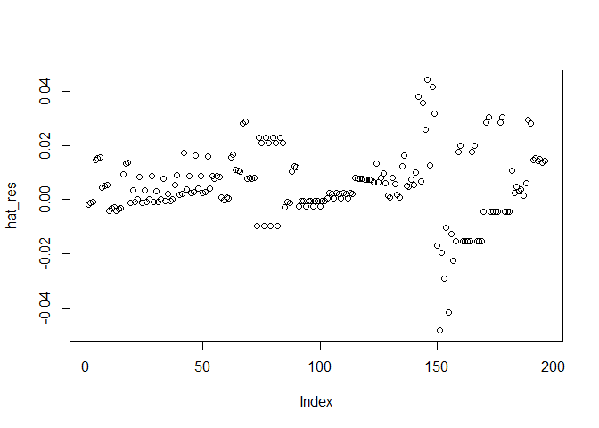
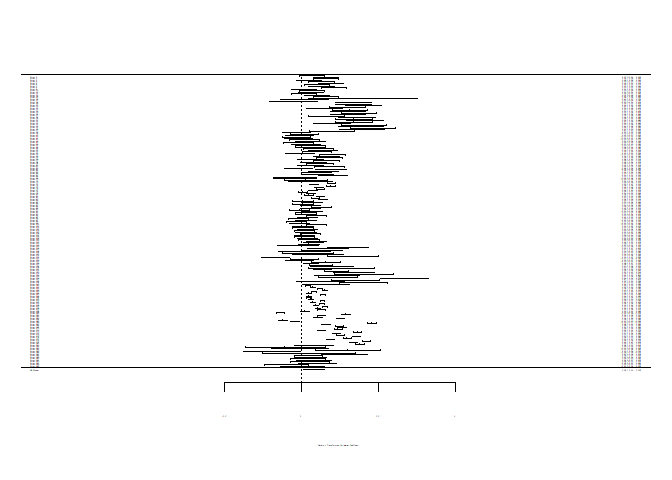

Child Maltreatment and Adolescent Substance Use – Main Analysis Report
================
Stephanie Boettiger & Timothy J. Luke
2022-10-05

``` r
source("calc_effectsizes.R")
```

    ## Loading required package: Matrix

    ## 
    ## Loading the 'metafor' package (version 3.0-2). For an
    ## introduction to the package please type: help(metafor)

    ## 
    ## Attaching package: 'dplyr'

    ## The following objects are masked from 'package:stats':
    ## 
    ##     filter, lag

    ## The following objects are masked from 'package:base':
    ## 
    ##     intersect, setdiff, setequal, union

``` r
source("analysis.R")
```

    ## -- Attaching packages --------------------------------------- tidyverse 1.3.1 --

    ## v ggplot2 3.3.5     v purrr   0.3.4
    ## v tibble  3.1.8     v stringr 1.4.1
    ## v tidyr   1.2.0     v forcats 0.5.1
    ## v readr   2.1.2

    ## -- Conflicts ------------------------------------------ tidyverse_conflicts() --
    ## x tidyr::expand() masks Matrix::expand()
    ## x dplyr::filter() masks stats::filter()
    ## x dplyr::lag()    masks stats::lag()
    ## x tidyr::pack()   masks Matrix::pack()
    ## x tidyr::unpack() masks Matrix::unpack()

    ## 
    ## Attaching package: 'psych'

    ## The following objects are masked from 'package:ggplot2':
    ## 
    ##     %+%, alpha

    ## Warning: Rows with NAs omitted from model fitting.

# Main Results

``` r
# results
res
```

    ## 
    ## Multivariate Meta-Analysis Model (k = 196; method: REML)
    ## 
    ## Variance Components:
    ## 
    ##             estim    sqrt  nlvls  fixed      factor 
    ## sigma^2.1  0.0064  0.0802     32     no  control_id 
    ## sigma^2.2  0.0015  0.0386      5     no      su_mod 
    ## 
    ## Test for Heterogeneity:
    ## Q(df = 195) = 5420.4503, p-val < .0001
    ## 
    ## Model Results:
    ## 
    ## estimate      se    zval    pval   ci.lb   ci.ub 
    ##   0.1221  0.0231  5.2760  <.0001  0.0767  0.1674  *** 
    ## 
    ## ---
    ## Signif. codes:  0 '***' 0.001 '**' 0.01 '*' 0.05 '.' 0.1 ' ' 1

``` r
# pooled correlation estimate
res_r
```

    ## 
    ##    pred  ci.lb  ci.ub   pi.lb  pi.ub 
    ##  0.1215 0.0766 0.1659 -0.0581 0.2934

``` r
confint(res)
```

    ## 
    ##           estimate  ci.lb  ci.ub 
    ## sigma^2.1   0.0064 0.0037 0.0120 
    ## sigma.1     0.0802 0.0605 0.1095 
    ## 
    ##           estimate  ci.lb  ci.ub 
    ## sigma^2.2   0.0015 0.0005 0.0093 
    ## sigma.2     0.0386 0.0216 0.0965

``` r
result2 
```

    ## 
    ## Random-Effects Model (k = 196; tau^2 estimator: HS)
    ## 
    ## tau^2 (estimated amount of total heterogeneity): 0.0106 (SE = 0.0021)
    ## tau (square root of estimated tau^2 value):      0.1031
    ## I^2 (total heterogeneity / total variability):   96.33%
    ## H^2 (total variability / sampling variability):  27.28
    ## 
    ## Test for Heterogeneity:
    ## Q(df = 195) = 5420.4503, p-val < .0001
    ## 
    ## Model Results:
    ## 
    ## estimate      se     zval    pval   ci.lb   ci.ub 
    ##   0.1272  0.0081  15.7629  <.0001  0.1114  0.1430  *** 
    ## 
    ## ---
    ## Signif. codes:  0 '***' 0.001 '**' 0.01 '*' 0.05 '.' 0.1 ' ' 1

``` r
result3
```

    ## 
    ## Random-Effects Model (k = 196; tau^2 estimator: HE)
    ## 
    ## tau^2 (estimated amount of total heterogeneity): 0.0161 (SE = 0.0019)
    ## tau (square root of estimated tau^2 value):      0.1270
    ## I^2 (total heterogeneity / total variability):   97.55%
    ## H^2 (total variability / sampling variability):  40.86
    ## 
    ## Test for Heterogeneity:
    ## Q(df = 195) = 5420.4503, p-val < .0001
    ## 
    ## Model Results:
    ## 
    ## estimate      se     zval    pval   ci.lb   ci.ub 
    ##   0.1281  0.0097  13.2301  <.0001  0.1091  0.1471  *** 
    ## 
    ## ---
    ## Signif. codes:  0 '***' 0.001 '**' 0.01 '*' 0.05 '.' 0.1 ' ' 1

``` r
# PEESE test 
PEESE
```

    ## 
    ## Multivariate Meta-Analysis Model (k = 196; method: REML)
    ## 
    ## Variance Components:
    ## 
    ##             estim    sqrt  nlvls  fixed      factor 
    ## sigma^2.1  0.0066  0.0814     32     no  control_id 
    ## sigma^2.2  0.0015  0.0391      5     no      su_mod 
    ## 
    ## Test for Residual Heterogeneity:
    ## QE(df = 194) = 5417.0067, p-val < .0001
    ## 
    ## Test of Moderators (coefficient 2):
    ## QM(df = 1) = 3.6824, p-val = 0.0550
    ## 
    ## Model Results:
    ## 
    ##          estimate      se    zval    pval    ci.lb    ci.ub 
    ## intrcpt    0.1025  0.0256  4.0126  <.0001   0.0525   0.1526  *** 
    ## mods       6.5685  3.4229  1.9190  0.0550  -0.1404  13.2773    . 
    ## 
    ## ---
    ## Signif. codes:  0 '***' 0.001 '**' 0.01 '*' 0.05 '.' 0.1 ' ' 1

``` r
PEESE_r
```

    ##          b      ci.lb      ci.ub 
    ## 0.10218369 0.05240732 0.15145357

``` r
# Precision effect test
PET
```

    ## 
    ## Multivariate Meta-Analysis Model (k = 196; method: REML)
    ## 
    ## Variance Components:
    ## 
    ##             estim    sqrt  nlvls  fixed      factor 
    ## sigma^2.1  0.0071  0.0844     32     no  control_id 
    ## sigma^2.2  0.0015  0.0392      5     no      su_mod 
    ## 
    ## Test for Residual Heterogeneity:
    ## QE(df = 194) = 5416.5519, p-val < .0001
    ## 
    ## Test of Moderators (coefficient 2):
    ## QM(df = 1) = 3.8717, p-val = 0.0491
    ## 
    ## Model Results:
    ## 
    ##          estimate      se    zval    pval   ci.lb   ci.ub 
    ## intrcpt    0.0767  0.0331  2.3171  0.0205  0.0118  0.1416  * 
    ## mods       0.9357  0.4756  1.9677  0.0491  0.0037  1.8678  * 
    ## 
    ## ---
    ## Signif. codes:  0 '***' 0.001 '**' 0.01 '*' 0.05 '.' 0.1 ' ' 1

``` r
PET_r
```

    ##          b      ci.lb      ci.ub 
    ## 0.07657030 0.01182464 0.14067659

``` r
#Cook's distance 
cd
```

    ##            1            2            3            4            5            6 
    ## 5.530647e-07 1.997786e-05 5.441530e-06 7.552789e-07 7.532859e-07 4.309262e-05 
    ##            7            8            9           10           11           12 
    ## 1.007278e-05 7.532782e-07 8.862980e-05 1.076432e-05 3.906152e-05 1.321713e-04 
    ##           13           14           15           16           17           18 
    ## 1.076422e-05 7.306353e-06 5.441539e-06 6.199247e-03 1.133558e-03 1.008642e-02 
    ##           19           20           21           22           23           24 
    ## 3.959872e-06 3.959872e-06 5.650622e-05 1.430203e-06 1.943666e-04 4.135853e-08 
    ##           25           26           27           28           29           30 
    ## 8.670880e-07 2.842440e-05 7.005969e-07 1.690383e-04 1.177511e-05 4.572223e-06 
    ##           31           32           33           34           35           36 
    ## 5.493272e-05 4.212723e-06 7.609687e-05 2.349867e-05 1.466366e-05 6.105361e-05 
    ##           37           38           39           40           41           42 
    ## 1.753036e-05 3.421920e-05 6.054019e-05 1.208023e-04 7.653452e-08 6.054019e-05 
    ##           43           44           45           46           47           48 
    ## 1.623303e-05 2.008852e-05 1.032204e-04 3.629062e-04 6.889899e-07 1.032204e-04 
    ##           49           50           51           52           53           54 
    ## 4.639907e-05 1.259013e-04 4.914999e-04 5.769361e-05 1.008155e-03 1.426159e-04 
    ##           55           56           57           58           59           60 
    ## 2.848994e-04 2.427638e-05 2.395594e-04 4.690577e-06 4.296664e-06 9.044880e-05 
    ##           61           62           63           64           65           66 
    ## 2.395594e-04 1.405212e-02 1.829060e-02 1.314325e-04 8.266637e-05 2.689431e-05 
    ##           67           68           69           70           71           72 
    ## 3.259389e-03 3.631187e-03 1.262090e-04 1.509172e-03 3.429016e-04 2.370513e-05 
    ##           73           74           75           76           77           78 
    ## 8.606091e-04 2.879234e-03 7.456825e-04 3.781739e-05 2.266603e-04 4.028051e-04 
    ##           79           80           81           82           83           84 
    ## 5.774103e-04 2.774643e-04 4.772956e-05 2.183175e-05 4.464598e-04 2.685793e-04 
    ##           85           86           87           88           89           90 
    ## 2.466553e-09 1.577157e-07 2.843813e-05 1.920923e-08 3.065241e-05 1.387097e-06 
    ##           91           92           93           94           95           96 
    ## 2.107228e-10 1.575039e-07 1.348681e-05 7.232251e-09 8.754826e-06 8.074730e-06 
    ##           97           98           99          100          101          102 
    ## 5.803626e-12 9.014545e-06 7.486635e-05 2.107286e-10 8.755345e-06 2.843814e-05 
    ##          103          104          105          106          107          108 
    ## 2.467013e-09 4.638695e-06 2.027484e-05 7.232229e-09 2.060669e-07 2.027485e-05 
    ##          109          110          111          112          113          114 
    ## 4.532501e-09 4.638681e-06 4.040504e-06 4.454661e-08 1.561052e-06 4.040507e-06 
    ##          115          116          117          118          119          120 
    ## 6.574360e-03 5.003074e-03 2.199426e-04 3.062532e-06 2.513645e-03 8.530166e-04 
    ##          121          122          123          124          125          126 
    ## 2.192955e-05 6.893535e-03 8.335847e-03 2.887067e-05 1.313616e-04 6.184310e-03 
    ##          127          128          129          130          131          132 
    ## 9.096773e-04 4.012587e-04 2.605392e-06 6.566223e-06 1.365774e-04 9.322590e-05 
    ##          133          134          135          136          137          138 
    ## 1.828407e-04 7.702443e-05 2.990233e-04 1.433968e-03 1.303973e-02 2.003466e-04 
    ##          139          140          141          142          143          144 
    ## 3.280127e-03 9.520377e-04 2.115894e-03 2.632706e-03 1.493717e-03 4.907905e-05 
    ##          145          146          147          148          149          150 
    ## 4.670188e-05 6.654841e-04 1.208497e-04 6.951114e-05 3.379152e-05 2.315696e-03 
    ##          151          152          153          154          155          156 
    ## 5.822095e-04 3.662303e-05 8.029344e-06 7.492618e-05 3.369749e-03 3.353030e-04 
    ##          157          158          159          160          161          162 
    ## 1.782382e-06 3.609421e-05 6.656989e-04 3.011974e-03 5.115645e-04 4.388732e-05 
    ##          163          164          165          166          167          168 
    ## 1.103122e-04 2.643010e-04 2.674307e-03 1.420907e-03 2.842145e-03 1.132279e-06 
    ##          169          170          171          172          173          174 
    ## 2.222720e-04 2.064433e-05 7.966994e-06 1.390115e-03 1.368278e-03 4.594224e-05 
    ##          175          176          177          178          179          180 
    ## 2.597831e-06 1.170515e-03 2.421887e-04 3.486555e-04 3.003827e-03 8.026526e-04 
    ##          181          182          183          184          185          186 
    ## 1.703231e-03 1.526538e-05 3.941200e-04 4.256700e-04 1.219077e-03 3.526149e-03 
    ##          187          188          189          190          191          192 
    ## 9.383865e-06 4.911200e-03 9.385123e-03 5.458071e-03 2.707492e-04 1.435189e-03 
    ##          193          194          195          196 
    ## 2.521101e-04 8.909921e-04 2.190655e-03 1.274972e-03

``` r
plot(cd, type = "o",
     pch = 19,
     xlab = "Observed Outcome",
     ylab = "Cook's Distance"
) 
```

<!-- -->

``` r
# Results with potential influential cases removed
res_cd
```

    ## 
    ## Multivariate Meta-Analysis Model (k = 183; method: REML)
    ## 
    ## Variance Components:
    ## 
    ##             estim    sqrt  nlvls  fixed      factor 
    ## sigma^2.1  0.0058  0.0761     28     no  control_id 
    ## sigma^2.2  0.0016  0.0398      5     no      su_mod 
    ## 
    ## Test for Heterogeneity:
    ## Q(df = 182) = 5287.8881, p-val < .0001
    ## 
    ## Model Results:
    ## 
    ## estimate      se    zval    pval   ci.lb   ci.ub 
    ##   0.1216  0.0239  5.0889  <.0001  0.0748  0.1684  *** 
    ## 
    ## ---
    ## Signif. codes:  0 '***' 0.001 '**' 0.01 '*' 0.05 '.' 0.1 ' ' 1

``` r
hat_res
```

    ##             1             2             3             4             5 
    ##  1.740425e-03  2.497785e-03  2.940983e-03  1.740425e-03  2.497785e-03 
    ##             6             7             8             9            10 
    ##  2.940983e-03  1.740425e-03  2.497785e-03  2.940983e-03  1.740425e-03 
    ##            11            12            13            14            15 
    ##  2.497785e-03  2.940983e-03  1.740425e-03  2.497785e-03  2.940983e-03 
    ##            16            17            18            19            20 
    ##  6.364924e-03  1.200321e-02  1.232182e-02  2.005774e-03  2.005774e-03 
    ##            21            22            23            24            25 
    ##  2.005774e-03  2.005774e-03  2.005774e-03  2.033344e-03  2.033344e-03 
    ##            26            27            28            29            30 
    ##  2.033344e-03  2.033344e-03  2.033344e-03  1.819671e-03  1.819671e-03 
    ##            31            32            33            34            35 
    ##  1.819671e-03  1.819671e-03  1.819671e-03  1.240685e-03  1.240685e-03 
    ##            36            37            38            39            40 
    ##  1.240685e-03  1.240685e-03  1.240685e-03  6.823465e-03  6.823465e-03 
    ##            41            42            43            44            45 
    ##  6.823465e-03  6.823465e-03  6.823465e-03  6.771646e-03  6.771646e-03 
    ##            46            47            48            49            50 
    ##  6.771646e-03  6.771646e-03  6.771646e-03  6.767161e-03  6.767161e-03 
    ##            51            52            53            54            55 
    ##  6.767161e-03  6.767161e-03  6.767161e-03  4.786084e-03  3.693721e-03 
    ##            56            57            58            59            60 
    ##  4.772903e-03  4.382827e-03  4.786084e-03  3.693721e-03  4.772903e-03 
    ##            61            62            63            64            65 
    ##  4.382827e-03  1.572302e-02  1.679842e-02  1.117508e-02  1.086553e-02 
    ##            66            67            68            69            70 
    ##  1.033656e-02  2.605310e-02  2.656252e-02  7.467731e-03  7.722372e-03 
    ##            71            72            73            74            75 
    ##  7.467731e-03  7.722372e-03  1.199182e-02  1.199182e-02  1.199182e-02 
    ##            76            77            78            79            80 
    ##  1.199182e-02  1.199182e-02  1.199182e-02  1.199182e-02  1.199182e-02 
    ##            81            82            83            84            85 
    ##  1.199182e-02  1.205911e-02  1.205911e-02  1.205911e-02 -1.136264e-06 
    ##            86            87            88            89            90 
    ##  1.829871e-03  1.807778e-03 -1.136264e-06  1.829871e-03  1.807778e-03 
    ##            91            92            93            94            95 
    ## -1.136264e-06  1.829871e-03  1.807778e-03 -1.136264e-06  1.829871e-03 
    ##            96            97            98            99           100 
    ##  1.807778e-03 -1.136264e-06  1.829871e-03  1.807778e-03 -1.136264e-06 
    ##           101           102           103           104           105 
    ##  1.829871e-03  1.807778e-03 -1.136264e-06  1.829871e-03  1.807778e-03 
    ##           106           107           108           109           110 
    ## -1.136264e-06  1.829871e-03  1.807778e-03 -1.136264e-06  1.829871e-03 
    ##           111           112           113           114           115 
    ##  1.807778e-03 -1.136264e-06  1.829871e-03  1.807778e-03  7.886485e-03 
    ##           116           117           118           119           120 
    ##  7.724511e-03  7.724511e-03  7.724511e-03  7.215692e-03  7.113158e-03 
    ##           121           122           123           124           125 
    ##  7.113158e-03  7.113158e-03  8.824443e-03  8.824443e-03  8.824443e-03 
    ##           126           127           128           129           130 
    ##  8.824443e-03  1.011980e-02  6.140551e-03  1.594944e-03  6.917982e-04 
    ##           131           132           133           134           135 
    ##  8.334977e-03  5.757431e-03  1.803837e-03  8.566332e-04  1.156536e-02 
    ##           136           137           138           139           140 
    ##  1.512393e-02  6.424269e-03  6.424269e-03  6.424269e-03  6.424269e-03 
    ##           141           142           143           144           145 
    ##  6.424269e-03  1.320111e-02 -1.841290e-02  1.281965e-02  1.530480e-03 
    ##           146           147           148           149           150 
    ##  1.320111e-02 -1.841290e-02  1.281965e-02  1.530480e-03  1.320111e-02 
    ##           151           152           153           154           155 
    ## -1.841290e-02  1.281965e-02  1.530480e-03  1.320111e-02 -1.841290e-02 
    ##           156           157           158           159           160 
    ##  1.281965e-02  1.530480e-03 -3.838412e-03 -3.838412e-03 -3.838412e-03 
    ##           161           162           163           164           165 
    ## -3.838412e-03 -3.838412e-03 -3.838412e-03 -3.838412e-03 -3.838412e-03 
    ##           166           167           168           169           170 
    ## -3.838412e-03 -3.838412e-03 -3.838412e-03 -3.838412e-03  6.878479e-03 
    ##           171           172           173           174           175 
    ##  6.878479e-03  6.878479e-03  6.878479e-03  6.878479e-03  6.878479e-03 
    ##           176           177           178           179           180 
    ##  6.878479e-03  6.878479e-03  6.878479e-03  6.878479e-03  6.878479e-03 
    ##           181           182           183           184           185 
    ##  6.878479e-03  9.498964e-03  2.219020e-03  4.360180e-03  3.386926e-03 
    ##           186           187           188           189           190 
    ##  4.321250e-03  1.635068e-03  6.812782e-03  2.899276e-02  2.655696e-02 
    ##           191           192           193           194           195 
    ##  1.419570e-02  1.481237e-02  1.363678e-02  1.414451e-02  1.272679e-02 
    ##           196 
    ##  1.311324e-02

``` r
plot(hat_res)
```

<!-- -->

``` r
# visualizations
forest(res)
```

<!-- -->

``` r
# alternative
forest_plot
```

<!-- -->

``` r
#study bias - plot to show asymmetry
funnel(res)
```

<!-- -->

``` r
# prettier funnel plot
funnelp
```

<!-- -->

# Moderator Analysis

``` r
# Child maltreatment measure 
cm_mod
```

    ## 
    ## Multivariate Meta-Analysis Model (k = 196; method: REML)
    ## 
    ## Variance Components:
    ## 
    ##             estim    sqrt  nlvls  fixed      factor 
    ## sigma^2.1  0.0067  0.0817     32     no  control_id 
    ## sigma^2.2  0.0015  0.0386      5     no      su_mod 
    ## 
    ## Test for Residual Heterogeneity:
    ## QE(df = 193) = 4338.4698, p-val < .0001
    ## 
    ## Test of Moderators (coefficients 1:3):
    ## QM(df = 3) = 28.6714, p-val < .0001
    ## 
    ## Model Results:
    ## 
    ##                          estimate      se    zval    pval    ci.lb   ci.ub 
    ## measure_modcase records    0.0976  0.0388  2.5171  0.0118   0.0216  0.1736    * 
    ## measure_modother           0.0761  0.0682  1.1151  0.2648  -0.0576  0.2098      
    ## measure_modself-report     0.1316  0.0249  5.2923  <.0001   0.0829  0.1804  *** 
    ## 
    ## ---
    ## Signif. codes:  0 '***' 0.001 '**' 0.01 '*' 0.05 '.' 0.1 ' ' 1

``` r
cm_mod2
```

    ## 
    ## Multivariate Meta-Analysis Model (k = 196; method: REML)
    ## 
    ## Variance Components:
    ## 
    ##             estim    sqrt  nlvls  fixed      factor 
    ## sigma^2.1  0.0067  0.0817     32     no  control_id 
    ## sigma^2.2  0.0015  0.0386      5     no      su_mod 
    ## 
    ## Test for Residual Heterogeneity:
    ## QE(df = 193) = 4338.4698, p-val < .0001
    ## 
    ## Test of Moderators (coefficients 2:3):
    ## QM(df = 2) = 1.2750, p-val = 0.5286
    ## 
    ## Model Results:
    ## 
    ##                         estimate      se     zval    pval    ci.lb   ci.ub 
    ## intrcpt                   0.0976  0.0388   2.5171  0.0118   0.0216  0.1736  * 
    ## measure_modother         -0.0215  0.0743  -0.2902  0.7717  -0.1671  0.1240    
    ## measure_modself-report    0.0340  0.0384   0.8850  0.3761  -0.0413  0.1093    
    ## 
    ## ---
    ## Signif. codes:  0 '***' 0.001 '**' 0.01 '*' 0.05 '.' 0.1 ' ' 1

``` r
# transforming Z to r scores
cm_r
```

    ##                                  b       ci.lb     ci.ub
    ## measure_modcase records 0.09731231  0.02160459 0.1719103
    ## measure_modother        0.07592785 -0.05756887 0.2067570
    ## measure_modself-report  0.13087873  0.08269464 0.1784523

``` r
# Child maltreatment type 
type_mod
```

    ## 
    ## Multivariate Meta-Analysis Model (k = 196; method: REML)
    ## 
    ## Variance Components:
    ## 
    ##             estim    sqrt  nlvls  fixed      factor 
    ## sigma^2.1  0.0122  0.1104     32     no  control_id 
    ## sigma^2.2  0.0015  0.0391      5     no      su_mod 
    ## 
    ## Test for Residual Heterogeneity:
    ## QE(df = 189) = 3709.2659, p-val < .0001
    ## 
    ## Test of Moderators (coefficients 1:7):
    ## QM(df = 7) = 824.3832, p-val < .0001
    ## 
    ## Model Results:
    ## 
    ##            estimate      se    zval    pval    ci.lb   ci.ub 
    ## mod_cmany    0.2027  0.0272  7.4614  <.0001   0.1495  0.2560  *** 
    ## mod_cmEA     0.0879  0.0292  3.0064  0.0026   0.0306  0.1452   ** 
    ## mod_cmEN     0.0245  0.0318  0.7700  0.4413  -0.0378  0.0867      
    ## mod_cmN      0.0655  0.0274  2.3892  0.0169   0.0118  0.1193    * 
    ## mod_cmPA     0.0632  0.0272  2.3273  0.0199   0.0100  0.1165    * 
    ## mod_cmPN     0.0468  0.0274  1.7070  0.0878  -0.0069  0.1006    . 
    ## mod_cmSA     0.0666  0.0272  2.4517  0.0142   0.0134  0.1199    * 
    ## 
    ## ---
    ## Signif. codes:  0 '***' 0.001 '**' 0.01 '*' 0.05 '.' 0.1 ' ' 1

``` r
type_mod2
```

    ## 
    ## Multivariate Meta-Analysis Model (k = 196; method: REML)
    ## 
    ## Variance Components:
    ## 
    ##             estim    sqrt  nlvls  fixed      factor 
    ## sigma^2.1  0.0122  0.1104     32     no  control_id 
    ## sigma^2.2  0.0015  0.0391      5     no      su_mod 
    ## 
    ## Test for Residual Heterogeneity:
    ## QE(df = 189) = 3709.2659, p-val < .0001
    ## 
    ## Test of Moderators (coefficients 2:7):
    ## QM(df = 6) = 804.0235, p-val < .0001
    ## 
    ## Model Results:
    ## 
    ##           estimate      se      zval    pval    ci.lb    ci.ub 
    ## intrcpt     0.2027  0.0272    7.4614  <.0001   0.1495   0.2560  *** 
    ## mod_cmEA   -0.1148  0.0130   -8.8448  <.0001  -0.1402  -0.0894  *** 
    ## mod_cmEN   -0.1783  0.0181   -9.8360  <.0001  -0.2138  -0.1427  *** 
    ## mod_cmN    -0.1372  0.0067  -20.3669  <.0001  -0.1504  -0.1240  *** 
    ## mod_cmPA   -0.1395  0.0054  -25.9328  <.0001  -0.1500  -0.1289  *** 
    ## mod_cmPN   -0.1559  0.0069  -22.7378  <.0001  -0.1693  -0.1424  *** 
    ## mod_cmSA   -0.1361  0.0054  -25.2973  <.0001  -0.1466  -0.1255  *** 
    ## 
    ## ---
    ## Signif. codes:  0 '***' 0.001 '**' 0.01 '*' 0.05 '.' 0.1 ' ' 1

``` r
# transforming Z to r scores
type_r
```

    ##                    b        ci.lb      ci.ub
    ## mod_cmany 0.19997361  0.148355375 0.25050520
    ## mod_cmEA  0.08768048  0.030587126 0.14420354
    ## mod_cmEN  0.02444791 -0.037768773 0.08647579
    ## mod_cmN   0.06542884  0.011771795 0.11871017
    ## mod_cmPA  0.06315414  0.009981421 0.11597071
    ## mod_cmPN  0.04680694 -0.006939879 0.10028410
    ## mod_cmSA  0.06655061  0.013366197 0.11935953

``` r
# Substance type
sub_mod
```

    ## 
    ## Multivariate Meta-Analysis Model (k = 196; method: REML)
    ## 
    ## Variance Components:
    ## 
    ##             estim    sqrt  nlvls  fixed      factor 
    ## sigma^2    0.0065  0.0807     32     no  control_id 
    ## 
    ## Test for Residual Heterogeneity:
    ## QE(df = 191) = 4838.2161, p-val < .0001
    ## 
    ## Test of Moderators (coefficients 1:5):
    ## QM(df = 5) = 663.9990, p-val < .0001
    ## 
    ## Model Results:
    ## 
    ##                     estimate      se    zval    pval   ci.lb   ci.ub 
    ## su_modalcohol         0.0649  0.0173  3.7508  0.0002  0.0310  0.0987  *** 
    ## su_modany             0.1111  0.0358  3.1040  0.0019  0.0410  0.1813   ** 
    ## su_modcigarette       0.1487  0.0174  8.5245  <.0001  0.1145  0.1829  *** 
    ## su_modillicit drug    0.1277  0.0175  7.2957  <.0001  0.0934  0.1620  *** 
    ## su_modmarijuana       0.1578  0.0175  8.9971  <.0001  0.1234  0.1922  *** 
    ## 
    ## ---
    ## Signif. codes:  0 '***' 0.001 '**' 0.01 '*' 0.05 '.' 0.1 ' ' 1

``` r
sub_mod2
```

    ## 
    ## Multivariate Meta-Analysis Model (k = 196; method: REML)
    ## 
    ## Variance Components:
    ## 
    ##             estim    sqrt  nlvls  fixed      factor 
    ## sigma^2    0.0065  0.0807     32     no  control_id 
    ## 
    ## Test for Residual Heterogeneity:
    ## QE(df = 191) = 4838.2161, p-val < .0001
    ## 
    ## Test of Moderators (coefficients 2:5):
    ## QM(df = 4) = 615.8609, p-val < .0001
    ## 
    ## Model Results:
    ## 
    ##                     estimate      se     zval    pval    ci.lb   ci.ub 
    ## intrcpt               0.0649  0.0173   3.7508  0.0002   0.0310  0.0987  *** 
    ## su_modany             0.0463  0.0398   1.1641  0.2444  -0.0316  0.1242      
    ## su_modcigarette       0.0838  0.0038  22.0367  <.0001   0.0764  0.0913  *** 
    ## su_modillicit drug    0.0629  0.0051  12.4294  <.0001   0.0530  0.0728  *** 
    ## su_modmarijuana       0.0930  0.0049  18.8760  <.0001   0.0833  0.1026  *** 
    ## 
    ## ---
    ## Signif. codes:  0 '***' 0.001 '**' 0.01 '*' 0.05 '.' 0.1 ' ' 1

``` r
# transforming Z to r scores
sub_r
```

    ##                             b      ci.lb      ci.ub
    ## su_modalcohol      0.06476556 0.03095585 0.09842723
    ## su_modany          0.11068815 0.04094196 0.17936087
    ## su_modcigarette    0.14761805 0.11401640 0.18088236
    ## su_modillicit drug 0.12703059 0.09313823 0.16062890
    ## su_modmarijuana    0.15651130 0.12280767 0.18985434

``` r
# Gender
gender_mod
```

    ## 
    ## Multivariate Meta-Analysis Model (k = 178; method: REML)
    ## 
    ## Variance Components:
    ## 
    ##             estim    sqrt  nlvls  fixed      factor 
    ## sigma^2.1  0.0050  0.0706     29     no  control_id 
    ## sigma^2.2  0.0032  0.0565      5     no      su_mod 
    ## 
    ## Test for Residual Heterogeneity:
    ## QE(df = 176) = 4666.9562, p-val < .0001
    ## 
    ## Test of Moderators (coefficient 2):
    ## QM(df = 1) = 4.3966, p-val = 0.0360
    ## 
    ## Model Results:
    ## 
    ##          estimate      se    zval    pval   ci.lb    ci.ub 
    ## intrcpt   12.9514  6.1168  2.1173  0.0342  0.9627  24.9402  * 
    ## gender     0.2591  0.1236  2.0968  0.0360  0.0169   0.5012  * 
    ## 
    ## ---
    ## Signif. codes:  0 '***' 0.001 '**' 0.01 '*' 0.05 '.' 0.1 ' ' 1
